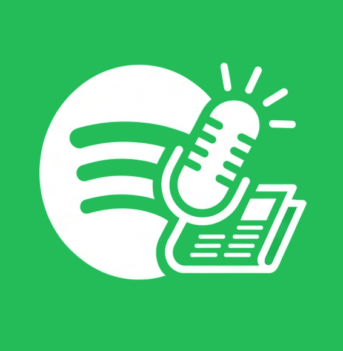

# Spotify Daily Briefing

<p align="center">
  <br>
  Automatically refresh a Spotify playlist with the latest episode from a curated list of news podcasts
</p>

## Table of Contents
- [Why This Exists](#why-this-exists)
- [Setup Guide (Get Your Own Running)](#setup-guide-get-your-own-running)
  - [Step 1: Fork this Repository](#step-1-fork-this-repository)
  - [Step 2: Create a Spotify Developer Application](#step-2-create-a-spotify-developer-application)
  - [Step 3: Generate your Spotify Refresh Token](#step-3-generate-your-spotify-refresh-token)
  - [Step 4: Add GitHub Secrets to your Fork](#step-4-add-github-secrets-to-your-fork)
  - [Step 5: Configure your Playlist and Lineup](#step-5-configure-your-playlist-and-lineup)
  - [Step 6: Enable GitHub Actions](#step-6-enable-github-actions)
  - [Step 7: Access Your Live Dashboard](#step-7-access-your-live-dashboard)
- [Managing Your Podcast Lineup](#managing-your-podcast-lineup)
- [How It Works](#how-it-works)
- [Workflow Schedule](#workflow-schedule)
- [Run Locally](#run-locally)

## Why This Exists

Google Assistant's old "Play the news" behavior is broken or unreliable for many users. This project serves as a modern replacement: it keeps a dedicated Spotify playlist updated with the latest news podcast episodes so you can get a fresh briefing on demand

You can trigger playback with a Gemini or Google Assistant routine to emulate the same "Play the news" experience (for example, a voice or scheduled routine that starts this specific playlist)

This repo contains:
- `config.json`: Centralized configuration file holding your playlist ID and podcast sources
- `sync_news.py`: Python script that reads the configuration, fetches the newest episode from each show, and replaces playlist items
- `.github/workflows/sync.yml`: GitHub Actions workflow that executes the script on an automated schedule


## Setup Guide (Get Your Own Running)

Follow these steps to deploy this automated sync tool on your own GitHub account.

### Step 1: Fork this Repository

1. Scroll to the top right of this page and click the **Fork** button
2. Uncheck "Copy the main branch only" if you want all assets, then click **Create fork**

### Step 2: Create a Spotify Developer Application

To talk to the Spotify API, you need credentials:
1. Go to the [Spotify Developer Dashboard](https://developer.spotify.com/dashboard) and log in with your Spotify account.
2. Click **Create App**
3. Name your app (e.g. `Daily News Briefing`) and give it a description
4. **Crucial:** In the **Redirect URIs** field, enter `http://localhost:8080` (this is required for Step 3)
5. Check the Developer Terms of Service box and click **Save**
6. On your new app dashboard, click **Settings** - Copy your **Client ID** and **Client Secret** somewhere safe

### Step 3: Generate your Spotify Refresh Token

Because this script runs automatically without human intervention, it needs a long-lived **Refresh Token** authorized to modify your playlists

1. Paste this URL into your browser, replacing `YOUR_CLIENT_ID` with the Client ID from Step 2:

   ```text
   https://accounts.spotify.com/authorize?client_id=YOUR_CLIENT_ID&response_type=code&redirect_uri=http://localhost:8080&scope=playlist-modify-public%20playlist-modify-private
   ```

2. Log in and click **Agree** to authorize your app
3. Your browser will redirect to an error page or a blank page loading `http://localhost:8080/?code=AQ...`. 
4. Copy the long code sequence right after `?code=` in your browser's address bar (exclude any trailing parameters like `&state=`)
5. Open your terminal and exchange that code for your tokens by running this command **(replace placeholders)**:

   ```bash
   curl -H "Authorization: Basic $(echo -n 'YOUR_CLIENT_ID:YOUR_CLIENT_SECRET' | base64)" -d grant_type=authorization_code -d code=YOUR_CODE_FROM_URL -d redirect_uri=http://localhost:8080 https://accounts.spotify.com/api/token
   ```

6. Look closely at the JSON response and copy the **`refresh_token`** string

### Step 4: Add GitHub Secrets to your Fork

To keep your tokens safe, add them as repository secrets instead of hardcoding them:
1. In your forked GitHub repository, click on **Settings** (the gear icon at the top)
2. On the left sidebar, navigate to **Secrets and variables** -> **Actions**
3. Click the **New repository secret** button and add the following three secrets:
   * `SPOTIFY_CLIENT_ID`
   * `SPOTIFY_CLIENT_SECRET`
   * `SPOTIFY_REFRESH_TOKEN`

### Step 5: Configure your Playlist and Lineup

1. Create a brand new public or private playlist in your Spotify app (e.g. "My Daily Briefing")
2. Copy the Playlist ID <br/>
   You can get this by clicking Share -> Copy link to playlist *(the ID is the long string of characters between `/playlist/` and `?si=`)*
3. In your GitHub repository repository, open **`config.json`**
4. Click the **Pencil Icon** (Edit this file) to swap out the placeholder playlist ID and add your favorite podcast show URLs (see the guide below)
5. Click **Commit changes...** to save

### Step 6: Enable GitHub Actions

By default, GitHub disables workflows on forked repositories to prevent accidental usage
1. Click on the **Actions** tab at the top of your repository page
2. Click the green button that says **"I understand my workflows, go ahead and enable them"**

### Step 7: Access Your Live Dashboard

The visual status dashboard can be hosted completely free on GitHub Pages:
1. Go to **Settings** -> **Pages** in your repository
2. Under **Build and deployment**, set the Source to **Deploy from a branch**
3. Select your primary branch (e.g. `main`) then click **Save**
4. Once GitHub builds the site (usually takes 1-2 minutes), your personal dashboard will be publicly accessible at: <br/>
   ```text
   https://<YOUR_GITHUB_USERNAME>.github.io/<YOUR_REPOSITORY_NAME>/dashboard/
   ```

## Managing Your Podcast Lineup

Your podcast lineup is entirely managed dynamically inside **`config.json`**

To update playlist targets, rearrange the playback sequence, or change your news lineup entirely, you can edit your configuration directly on GitHub.com without touching the Python script:

```json
{
  "playlist_id": "YOUR_PLAYLIST_ID",
  "show_ids": [
    "[https://open.spotify.com/show/4rOoJ6Egrf8K2I68g97g66](https://open.spotify.com/show/4rOoJ6Egrf8K2I68g97g66)",
    "[https://open.spotify.com/show/36N97g664rOoJ6Egrf8K2I](https://open.spotify.com/show/36N97g664rOoJ6Egrf8K2I)",
    "[https://open.spotify.com/show/2I68g97g664rOoJ6Egrf8K](https://open.spotify.com/show/2I68g97g664rOoJ6Egrf8K)"
  ]
}
```

> **Tip:** The script automatically extracts the unique 22-character show ID from each URL, so tracking query parameters (like `?si=...`) will not break the execution. Items will be added to your playlist in the exact top-to-bottom order listed here

## How It Works

1. The GitHub Actions runner triggers the Python script
2. The script exchanges your long-lived Spotify **Refresh Token** for a temporary **Access Token**
3. The script reads `config.json` to extract your target playlist ID and source links
4. It loops through the links, requests the single most recent track (`limit=1`) from Spotify's catalog for each show, and collects their URIs
5. It sends an atomic `PUT` request to the Spotify `/items` endpoint, completely wiping yesterday's tracks and setting up the new lineup in one clean operation

## Workflow Schedule

The workflow is configured in `.github/workflows/sync.yml` and triggers automatically:

* **Every hour at minute 0** (`cron: '0 * * * *'`) to ensure your floating schedule always has current feeds
* **On manual trigger** (`workflow_dispatch`) via the "Run workflow" button in your GitHub Actions tab for instant testing

## Run Locally

If you want to test the execution locally inside your workspace terminal:

1. Export your credentials into your active session:
```bash
export SPOTIFY_CLIENT_ID="your_client_id"
export SPOTIFY_CLIENT_SECRET="your_client_secret"
export SPOTIFY_REFRESH_TOKEN="your_refresh_token"
```

2. Install dependencies:
```bash
pip install requests
```

3. Execute the worker sync:
```bash
python sync_news.py
```
